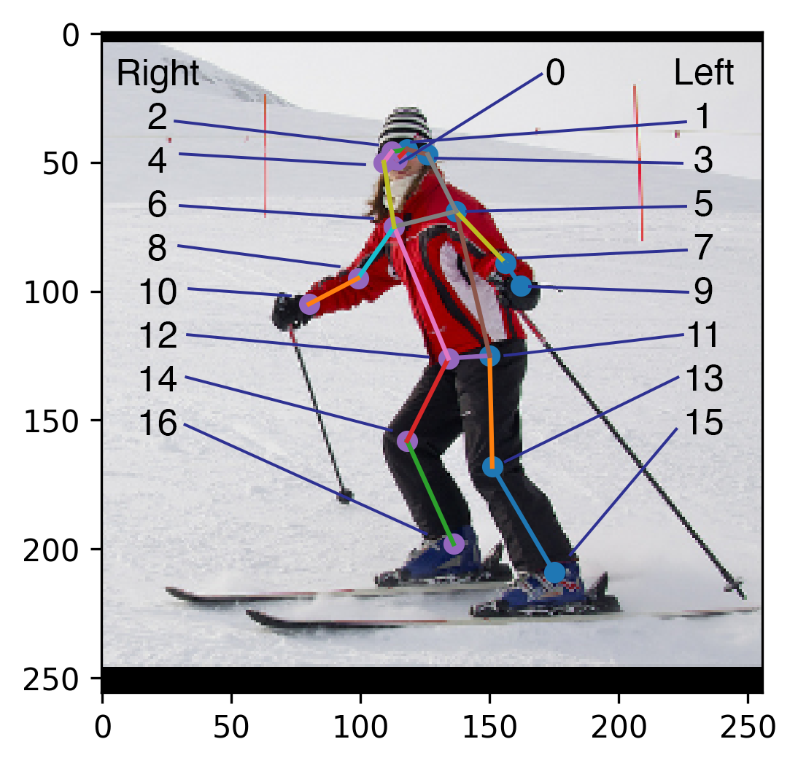

- [golf](#golf)
  - [Dependency](#dependency)
  - [Algo](#algo)
    - [Detector](#detector)
    - [Matcher](#matcher)
  - [Data](#data)
  - [Usage](#usage)
    - [Setup](#setup)
    - [Run](#run)
  - [Reference](#reference)

# golf

## Dependency
Python == 3.10

## Algo

### Detector

**Mediapipe**

- keypoints:


**YOLOv8**



### Matcher

## Data

download link: https://pan.baidu.com/s/15PUYy9mzw7yw-5AaZ8e51g?pwd=vw94 password: vw94 

```
.
├── practice_case
│   ├── practice_1.mp4
│   └── practice_2.mp4
├── results
│   ├── 0.png
│   ├── 1.png
│   ├── 2.png
│   └── 3.png
└── standard
    ├── frame_120.jpg
    ├── frame_150.jpg
    ├── frame_30.jpg
    ├── frame_60.jpg
    ├── frame_90.jpg
    └── standard.mp4
```

## Usage

### Setup

Create a new conda environment

```bash
conda create -n golf python=3.10
```

Enter the environment and install the dependencies
```bash
conda activate golf
pip install -r requirements.txt
```

### Run

Using config file
```bash
python main.py --config_file="config.yaml"
```

```bash
python main.py \
--standard_video_path="data/standard/standard.mp4" \
--practice_video_path="data/practice_case/practice_1.mp4" \
--standard_path="data/standard/" \
--frame_interval=0.5 \
--display
```

## Reference

[proposal](https://y0poyx843w.feishu.cn/docx/OwZ2d0w4YoDGfix41mMc1cRanob)

[Mediapipe APIs](https://github.com/google/mediapipe/blob/master/docs/solutions/pose.md#solution-apis)

[OpenCV general documentations](https://docs.opencv.org/4.x/)

[yolov8](https://github.com/ultralytics/ultralytics)

```
golf-main-430
├─ .gitignore
├─ config.yaml
├─ images
│  ├─ coco_keypoints.png
│  └─ keypoints.png
├─ main.py
├─ README.md
├─ requirements.txt
├─ src
│  ├─ detectors
│  │  ├─ base_detector.py
│  │  ├─ detector_factory.py
│  │  ├─ mp_detector.py
│  │  └─ yolo_detector.py
│  ├─ matchers
│  │  ├─ base_matcher.py
│  │  ├─ matcher_factory.py
│  │  ├─ mp_matcher.py
│  │  └─ yolo_matcher.py
│  └─ visualize
│     ├─ base_visualization
│     └─ visual_factory.py
├─ test.py
└─ util
   ├─ process.py
   └─ __init__.py

```